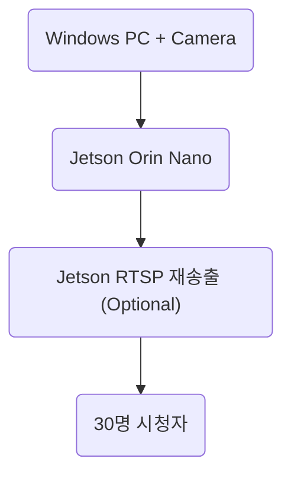

# RTSP 기반 실시간 객체 탐지 시스템 확장 가능성 검토

## 1. 개요
본 문서는 Jetson Orin Nano를 활용하여 RTSP 스트림 기반 실시간 객체 탐지 시스템을 운영하는 과정에서, 향후 윈도우 환경에서 직접 카메라를 연결하여 스트리밍 서버를 구성하고, 다수의 사용자(약 30명)가 해당 스트림에 접속하는 상황에 대한 기술적 가능성과 고려 사항을 정리한 것입니다.

기존 시스템은 Jetson 디바이스에서 YOLOv8 모델 및 NVIDIA DeepStream Pipeline을 활용하여 실시간 객체 탐지 및 성능 측정을 수행하는 구조로 구축되어 있습니다. 해당 구조는 RTSP 입력을 기반으로 동작하므로, 입력 스트림의 출처를 변경하는 방식으로 손쉽게 확장할 수 있습니다.

---

## 2. 윈도우 기반 RTSP 스트리밍 서버 구성 가능성
윈도우 PC에 USB 또는 IP 카메라를 연결하고 이를 RTSP 스트리밍 형태로 송출하는 방식은 다음과 같은 이유로 적용할 수 있습니다.

- 기존 Jetson 처리 파이프라인은 **RTSP URL 형태의 입력**을 그대로 사용할 수 있습니다.
- GStreamer, VLC, OBS Studio, FFmpeg 등의 스트리밍 도구를 활용하여 윈도우에서 RTSP 서버를 쉽게 구성할 수 있습니다.
- Jetson 측에서는 기존 설정을 변경할 필요 없이 스트림 입력 주소만 변경하면 동일한 탐지 및 평가 환경을 유지할 수 있습니다.

---

## 3. 다수 사용자(약 30명) 동시 접속 가능성

### 장점
- 처리 결과 스트림 또는 원본 스트림을 **Jetson 또는 Windows에서 재송출하여 공유**할 수 있습니다.
- 클라이언트는 웹 브라우저, VLC, 또는 전용 뷰어를 통해 단순 시청이 가능합니다.

### 고려해야 할 요소
| 항목 | 설명 |
|---|---|
| 네트워크 대역폭 | 1080p 스트림 기준 사용자 수가 증가할수록 대역폭 요구량이 증가합니다. |
| 인코딩 부하 | 스트리밍 서버(윈도우 PC 또는 Jetson) 측에서 영상 인코딩 시 CPU/GPU 자원이 소모됩니다. |
| Jetson 처리 부하 | Jetson은 탐지 연산을 담당하므로 재송출까지 수행할 경우 성능 부담이 커질 수 있습니다. |
| 지연(Latency) | 스트림 송출 → Jetson 처리 → 결과 전송 과정에서 지연이 발생할 수 있습니다. |

### 결론
- **단일 RTSP 입력 + 다수 사용자 시청 구조는 실현 가능합니다.**
- 다만 **대역폭 확보 및 스트리밍 서버/Jetson 자원 사용률 모니터링이 필요합니다.**

---

## 4. 권장 아키텍처
다수 사용자 접속을 안정적으로 지원하기 위해 다음 구성을 권장합니다.

또는 **Windows 서버에서 재송출 역할을 담당**하여 Jetson의 연산 리소스를 탐지 연산에 집중시키는 방식도 고려 가능합니다.

---

## 5. 종합 평가
| 평가 항목 | 결과 |
|---|---|
| 윈도우 → RTSP 스트림 송출 가능 여부 | 가능합니다. |
| Jetson에서 동일 파이프라인 처리 가능 여부 | 가능합니다. |
| 약 30명 접속 기반 시연 가능 여부 | 가능합니다. 다만 네트워크와 재송출 자원 검토가 필요합니다. |
| 추가 고려 사항 | 처리 지연, 네트워크 대역폭, 스트리밍 인코딩 부하가 존재합니다. |

---

## 6. 결론
본 프로젝트는 **입력 스트림 소스 변경을 통해 손쉽게 확장할 수 있으며**, 윈도우 기반 스트리밍 서버를 활용할 경우 실시간 영상 처리 및 다수 사용자 시연 환경을 구성하는 것이 기술적으로 가능합니다.  
다만, 안정적인 운영을 위해 **네트워크 환경 및 스트리밍 자원 배분 계획을 함께 수립하는 것이 바람직합니다.**
